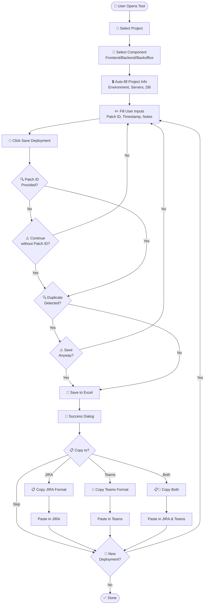

# 📋 Deployment Checklist Tool - Complete Guide

## 🎯 What is This Tool?

**chklst** is an internal deployment tracking and management tool designed to streamline your software deployment workflow. It helps teams track deployments across multiple projects and environments while maintaining proper documentation and communication through JIRA and Microsoft Teams integration.

### Key Features
- ✅ **Project Management** - Manage multiple projects with Frontend, Backend, and Backoffice components
- ✅ **Deployment Tracking** - Track every deployment with detailed information
- ✅ **JIRA Integration** - One-click copy to JIRA with formatted tables
- ✅ **Teams Integration** - One-click copy to Microsoft Teams with formatted messages
- ✅ **Excel Storage** - All data stored in Excel files (easy backup and sharing)
- ✅ **Duplicate Detection** - Warns about potential duplicate deployments
- ✅ **History Tracking** - View all past deployments
- ✅ **Dark Theme UI** - Easy on the eyes for long working hours

---

## 🏢 Where to Use This Tool?

### Perfect For:
- **Development Teams** - Track daily deployments to QA/UAT/Production
- **DevOps Teams** - Maintain deployment logs and history
- **Project Managers** - Monitor deployment frequency and success rates
- **QA Teams** - Track which version is deployed where
- **Release Managers** - Coordinate releases across multiple projects

### Use Cases:
1. **Daily QA Deployments** - Quick logging of routine QA deployments
2. **UAT Release Documentation** - Formal documentation for UAT releases
3. **Production Deployments** - Critical production deployment tracking with full details
4. **Hotfix Tracking** - Emergency hotfix deployment logging
5. **Multi-Project Environments** - Organizations with 5+ projects to manage

---

## 🚀 Getting Started

### Installation

```bash
# Navigate to project directory
cd chklst

# Activate virtual environment
pipenv shell

# Run the application
python main_new.py
```

### First Time Setup

1. **Launch the application**
2. **Go to "📁 Projects" tab**
3. **Click "Add Project"**
4. **Fill in project details:**
   - Project Name (e.g., "BRHUB")
   - Build Server (e.g., "192.168.1.149")
   - Deploy Server (e.g., "192.168.1.60")
   - Database Name
   - Environment (QA/UAT/PROD)
   - Backup Location
5. **Configure Components:**
   - Enable Frontend/Backend/Backoffice as needed
   - Add Component Names
   - Add Developer Names
   - Add VCS URLs
   - Add Component URLs (for Frontend/Backoffice)
6. **Click "Save All Changes"**

---

## 📊 System Architecture

```
┌─────────────────────────────────────────────────────────────────┐
│                     DEPLOYMENT TOOL ARCHITECTURE                 │
└─────────────────────────────────────────────────────────────────┘

┌──────────────┐         ┌──────────────┐         ┌──────────────┐
│   PyQt5 UI   │────────▶│  JSON Files  │────────▶│ Excel Files  │
│  (Dark Theme)│         │  (Projects)  │         │(Deployments) │
└──────────────┘         └──────────────┘         └──────────────┘
       │                                                   │
       │                                                   │
       ▼                                                   ▼
┌──────────────┐                                  ┌──────────────┐
│   Formatter  │                                  │   Reports    │
│ JIRA | Teams │                                  │   History    │
└──────────────┘                                  └──────────────┘
```

---

## 🔄 Deployment Workflow



---

## 📝 Step-by-Step User Guide

### **Step 1: Select Project**

```
┌─────────────────────────────────────────────────┐
│ Project: [BRHUB                         ▼]     │
└─────────────────────────────────────────────────┘
```

- Open the "📝 Deployment" tab
- Click the dropdown and select your project (e.g., "BRHUB")

---

### **Step 2: Select Component**

```
┌─────────────────────────────────────────────────┐
│ Component: ● Frontend  ○ Backend  ○ Backoffice │
└─────────────────────────────────────────────────┘
```

- Choose which component you're deploying:
  - **Frontend** - Web UI, Angular/React apps
  - **Backend** - API, Services, Java/Python apps
  - **Backoffice** - Admin panels, Internal tools

---

### **Step 3: Review Auto-filled Information**

The following fields are automatically filled from your project configuration:

```
┌──────────────────────────────────────────────┐
│ 🔒 Auto-filled from Project Configuration   │
├──────────────────────────────────────────────┤
│ Environment:     QA                          │
│ Developer:       Karthiga                    │
│ Build Server:    192.168.1.149              │
│ Deploy Server:   192.168.1.60->192.168.14.8│
│ Database:        BR_HUB_QA                  │
│ Backup Path:     C:\TTS\REManagement\...   │
│ VCS URL:         https://git...             │
└──────────────────────────────────────────────┘
```

✅ **No need to type these - they're automatically loaded!**

---

### **Step 4: Fill Required Information**

```
┌──────────────────────────────────────────────┐
│ ✏️ User Input Required                       │
├──────────────────────────────────────────────┤
│ JIRA PATCH ID:   [PAT-209              ]    │
│ Timestamp:       [01-Oct-2025 3:00PM   ] 📅│
│ Database Script: [migration_v2.sql     ]    │
│ Status:          ☑ Build Success            │
│                  ☑ Deploy Success           │
│ Notes:           [Added new login flow ]    │
│ Deployed By:     [Kannan               ]    │
└──────────────────────────────────────────────┘
```

**Important Fields:**
- **JIRA PATCH ID** - Optional but recommended (e.g., PAT-209, JIRA-1234)
- **Timestamp** - Auto-set to now, but you can change it
- **Deployed By** - Your name (auto-filled from settings)

---

### **Step 5: Save Deployment**

```
┌─────────────────────────────────────────┐
│      [💾 SAVE DEPLOYMENT]              │
└─────────────────────────────────────────┘
```

Click the green **"💾 SAVE DEPLOYMENT"** button.

**What Happens:**
1. ✅ Validates required fields
2. ⚠️ Checks if Patch ID is missing (asks if you want to continue)
3. 🔍 Checks for duplicate deployments
4. 💾 Saves to Excel file
5. 🎉 Shows success dialog

---

### **Step 6: Copy to JIRA/Teams**

After successful save, you'll see this dialog:

```
┌──────────────────────────────────────────────────┐
│    🎉 Deployment Saved Successfully!            │
├──────────────────────────────────────────────────┤
│ 📋 Deployment Summary                           │
│ • Project: BRHUB                                │
│ • Component: BR-IWS                             │
│ • JIRA ID: PAT-209                              │
│ • Environment: QA                               │
│ • Timestamp: 01-Oct-2025 3:00PM                 │
│ • Build Status: ✅ Success                      │
│ • Deploy Status: ✅ Success                     │
├──────────────────────────────────────────────────┤
│ 📋 Copy to Clipboard                            │
│ ☑ Copy for JIRA                                 │
│ ☑ Copy for Microsoft Teams                      │
├──────────────────────────────────────────────────┤
│        [✅ Done]    [📝 New Deployment]         │
└──────────────────────────────────────────────────┘
```

**Options:**
- ☑ **Copy for JIRA** - Copies formatted table for JIRA
- ☑ **Copy for Teams** - Copies formatted message for Teams
- Check both to copy to both platforms
- Click **✅ Done** to finish
- Click **📝 New Deployment** to start a new entry

---

## 📋 Copy Formats

### JIRA Format (Markdown Table)

```markdown
| Field | Value |
|-------|-------|
| JIRA Ticket | PAT-209 |
| Project | BRHUB - BR-IWS |
| Environment | QA |
| Timestamp | 01-Oct-2025 3:00PM |
| Component URL | https://brhub.example.com |
| Build Server | 192.168.1.149 |
| Build Status | ✅ Success |
| Deploy Server | 192.168.1.60->192.168.14.8 |
| Deploy Status | ✅ Success |
| VCS URL | https://git.example.com/brhub |
| Database | BR_HUB_QA (DB backup taken) |
| Backup Location | C:\TTS\REManagement\Tomcat-BR-HUB\backup |
| Deployed By | Kannan |
```

**How to Use:**
1. Copy from tool
2. Paste into JIRA comment/description
3. JIRA will automatically render it as a table

---

### Teams Format (Formatted Message)

```
🎫 PATCH: PAT-209 | BRHUB - Deployment Complete

• Project: BRHUB - BR-IWS
• Environment: QA
• URL: https://brhub.example.com
• Build Server: 192.168.1.149
• Build Status: Success ✅
• Git URL: https://git.example.com/brhub
• Deploy Server: 192.168.1.60->192.168.14.8
• Deploy Status: Success ✅
• Database: BR_HUB_QA (DB backup taken)
• Backup Location: C:\TTS\REManagement\Tomcat-BR-HUB\backup
• Developer: Karthiga
• Deployed By: Kannan
• Timestamp: 01-Oct-2025 3:00PM

• Notes: Added new login flow
```

**How to Use:**
1. Copy from tool
2. Paste into Teams channel
3. Message is ready-to-read with emojis and formatting

---

## ⚡ Efficiency Tips

### 1. **Pre-configure Projects**
Set up all your projects once in the "📁 Projects" tab. This saves time during daily deployments.

### 2. **Use Default "Deployed By"**
Go to "⚙️ Settings" and set your default name. It will auto-fill every time.

### 3. **Quick Timestamp Buttons**
- Click **NOW** button to set current time
- Use **📅** button for calendar picker
- Use **🕐** button for time presets (9:00 AM, 12:00 PM, etc.)

### 4. **Batch Deployments**
After saving, click **📝 New Deployment** to quickly log another deployment without restarting.

### 5. **Component URL Best Practice**
Always fill Component URLs for Frontend and Backoffice. This helps team members quickly access deployed apps.

### 6. **Patch ID Format**
Use consistent format:
- ✅ `PAT-209` (Good)
- ✅ `JIRA-1234` (Good)
- ❌ `patch 209` (Avoid)
- ❌ `PAT209` (Avoid)

---

## 🔧 Project Configuration Guide

### Project-Level Fields

| Field | Example | Description |
|-------|---------|-------------|
| **Project Name** | BRHUB | Short, unique identifier |
| **Build Server** | 192.168.1.149 | Jenkins/Build server IP |
| **Deploy Server** | 192.168.1.60->192.168.14.8 | Deployment target(s) |
| **DB Name** | BR_HUB_QA | Database name |
| **Environment** | QA, UAT, PROD | Deployment environment |
| **Backup Location** | C:\TTS\RE\backup | Database backup path |

### Component-Level Fields

| Field | Example | Frontend | Backend | Backoffice |
|-------|---------|----------|---------|------------|
| **Component Name** | BR-IWS | ✅ | ✅ | ✅ |
| **Developer Name** | Karthiga | ✅ | ✅ | ✅ |
| **VCS Type** | Git | ✅ | ✅ | ✅ |
| **VCS URL** | https://git... | ✅ | ✅ | ✅ |
| **Build Command** | npm run build | ✅ | ✅ | ✅ |
| **Component URL** | https://app... | ✅ | ❌ | ✅ |

**Note:** Component URL is only for Frontend and Backoffice (user-facing apps), not Backend (APIs/services).

---

## 📊 Understanding the Tabs

### 📝 Deployment Tab
**Purpose:** Main workflow - log new deployments

**When to Use:**
- After building code successfully
- Before notifying team in JIRA/Teams
- For record-keeping

---

### 📁 Projects Tab
**Purpose:** Manage project configurations

**When to Use:**
- Adding new projects
- Updating server IPs
- Changing developer assignments
- Adding new components
- Updating component URLs

**Tip:** To delete a project, remove its JSON file from the `projects/` folder.

---

### 💾 Last Saved Tab
**Purpose:** Quick view of recent deployment

**When to Use:**
- Verify your last save
- Quickly reference previous deployment
- Copy again if you forgot to copy earlier

---

### 📊 Reports Tab
**Purpose:** View deployment history and statistics

**When to Use:**
- End of day summary
- Weekly deployment reports
- Finding past deployment details
- Checking deployment frequency

---

### ⚙️ Settings Tab
**Purpose:** Configure user preferences

**When to Use:**
- First time setup
- Changing default values
- Updating your name

---

### ℹ️ About Tab
**Purpose:** Version info and credits

---

## 🎯 Best Practices

### Do's ✅
- ✅ Always fill Patch ID when available
- ✅ Set correct timestamp (important for audit trails)
- ✅ Write meaningful notes
- ✅ Configure component URLs
- ✅ Use consistent naming conventions
- ✅ Save before copying to JIRA/Teams
- ✅ Backup Excel files regularly

### Don'ts ❌
- ❌ Don't skip "Deployed By" field
- ❌ Don't use same Patch ID for different components
- ❌ Don't delete Excel files without backup
- ❌ Don't share deployment credentials in notes
- ❌ Don't use special characters in project names
- ❌ Don't forget to check for duplicates

---

## 🚨 Common Scenarios

### Scenario 1: Emergency Hotfix Deployment

```
1. Open tool
2. Select Project: "PRODUCTION-APP"
3. Select Component: Backend
4. Fill Patch ID: "HOTFIX-001"
5. Change Timestamp if needed
6. Add Notes: "Critical bug fix for login issue"
7. Save
8. Copy to JIRA and Teams
9. Notify team immediately
```

**Time Taken:** ~30 seconds

---

### Scenario 2: Forgot to Add Patch ID

```
User clicks "Save Deployment"
   ↓
Tool shows: "⚠️ Patch ID is missing! Continue anyway?"
   ↓
Option 1: Click "No" → Go back and add Patch ID
Option 2: Click "Yes" → Save with "N/A"
```

**Recommendation:** Only skip Patch ID for internal testing deployments.

---

### Scenario 3: Duplicate Deployment Warning

```
User clicks "Save Deployment"
   ↓
Tool shows: "⚠️ Duplicate Deployment Detected!"
   ↓
Shows existing deployment details
   ↓
Option 1: Click "No" → Review and cancel
Option 2: Click "Yes" → Save anyway (logged as duplicate)
```

**When to Save Anyway:** Re-deployment or rollback scenarios.

---

### Scenario 4: Multiple Components Same Time

```
Deploying Frontend + Backend together:

1. Save Frontend deployment first
2. Copy to JIRA/Teams
3. Click "New Deployment"
4. Switch to Backend component
5. Save Backend deployment
6. Copy to JIRA/Teams
7. Done!
```

**Time Taken:** ~1 minute for both

---

## 📁 File Structure

```
chklst/
├── main_new.py                 # Application entry point
├── ui/
│   ├── simple_deployment_new.py   # Main deployment form
│   ├── simple_projects_form.py    # Project management
│   ├── simple_reports.py          # Reports viewer
│   ├── simple_last_saved.py       # Last saved view
│   ├── simple_settings.py         # Settings
│   └── dark_theme.py              # UI theme
├── utils/
│   ├── json_manager.py            # Project data handler
│   ├── excel_manager.py           # Deployment storage
│   ├── integration_formatter.py   # JIRA/Teams formatters
│   └── settings_manager.py        # Settings handler
├── projects/                      # Project JSON files
│   ├── BRHUB.json
│   ├── MBANK.json
│   └── ...
├── deployments.xlsx               # All deployment records
└── settings.json                  # User settings
```

---

## 🔐 Data Storage

### Projects
- **Location:** `projects/` folder
- **Format:** JSON files (one per project)
- **Naming:** `ProjectName.json`
- **Backup:** Copy entire `projects/` folder

### Deployments
- **Location:** `deployments.xlsx`
- **Format:** Excel workbook with sheets per project
- **Backup:** Copy `deployments.xlsx` daily/weekly

### Settings
- **Location:** `settings.json`
- **Format:** JSON
- **Contains:** User preferences, default values

---

## 🔄 Backup Strategy

### Daily Backup (Automated - Recommended)
```bash
# Create backup script (backup.sh)
#!/bin/bash
DATE=$(date +%Y-%m-%d)
mkdir -p backups/$DATE
cp deployments.xlsx backups/$DATE/
cp -r projects/ backups/$DATE/
```

### Manual Backup
1. Copy `deployments.xlsx` to network drive
2. Copy `projects/` folder to network drive
3. Rename with date: `deployments_2025-10-01.xlsx`

---

## 🎓 Training Checklist

For new team members:

- [ ] Install Python and Pipenv
- [ ] Clone/download the tool
- [ ] Run `pipenv shell` and `python main_new.py`
- [ ] Tour all 6 tabs
- [ ] Configure 1 project as practice
- [ ] Log 1 test deployment
- [ ] Copy to JIRA format (test in sandbox)
- [ ] Copy to Teams format (test in test channel)
- [ ] Set default "Deployed By" name
- [ ] Bookmark this guide

**Estimated Training Time:** 15-20 minutes

---

## 📞 Support & Troubleshooting

### Issue: Tool won't start
```bash
# Solution:
pipenv install
pipenv shell
python main_new.py
```

### Issue: Projects not loading
```bash
# Solution: Check projects/ folder exists
ls projects/
```

### Issue: Can't save deployment
- Check if `deployments.xlsx` is open in Excel
- Close Excel and try again

### Issue: Lost data
- Check `backups/` folder
- Restore from latest backup

---

## 🎯 Quick Reference Card

```
┌────────────────────────────────────────────────────┐
│            DEPLOYMENT TOOL QUICK REFERENCE          │
├────────────────────────────────────────────────────┤
│ 🚀 START:    pipenv shell → python main_new.py    │
│ 📝 DEPLOY:   Select → Fill → Save → Copy          │
│ 📁 PROJECTS: Add → Configure → Save               │
│ 💾 FORMAT:   dd-MMM-yyyy h:mmAP                   │
│ 📋 COPY:     Save first, then copy                │
│ ⚠️  PATCH:    Validated at Save time               │
│ 🔄 BACKUP:   Copy deployments.xlsx weekly         │
└────────────────────────────────────────────────────┘
```

---

## 📈 Success Metrics

Track these to measure tool effectiveness:

- ✅ **Deployment Documentation Rate:** 100% of deployments logged
- ✅ **Time Saved:** ~5 minutes per deployment (vs. manual email/docs)
- ✅ **Communication Speed:** Instant JIRA/Teams updates
- ✅ **Audit Trail:** Complete history with timestamps
- ✅ **Team Visibility:** Everyone knows what's deployed where

---

## 🚀 Future Enhancements (Roadmap)

- 🔄 Auto-backup to network drive
- 📧 Email notifications
- 🔗 Direct JIRA API integration (auto-post)
- 🔗 Direct Teams API integration (auto-post)
- 📊 Dashboard with charts
- 🔍 Advanced search and filters
- 📱 Mobile/web version
- 🔐 User authentication

---

## 📜 Version History

### v2.0 (Current)
- ✅ Component URL support (Frontend/Backoffice)
- ✅ Improved timestamp format (01-Oct-2025 3:00PM)
- ✅ Patch ID validation at save time
- ✅ Removed "Project URL" field
- ✅ Clean copy format (no headers)

### v1.0
- Initial release with basic deployment tracking

---

## 📄 License & Credits

**License:** Internal Use Only

**Developed By:** [Your Organization Name]

**Contributors:**
- Development Team
- DevOps Team
- QA Team

**Support:** [Your Support Email/Channel]

---

## 🎉 Conclusion

This tool is designed to make your deployment workflow **faster, cleaner, and more organized**.

**Remember:**
- 📝 Log every deployment
- 📋 Copy to JIRA/Teams for visibility
- 🔄 Backup your data regularly
- 📚 Refer to this guide when needed

**Happy Deploying! 🚀**

---

*Last Updated: 01-Oct-2025*
*Document Version: 1.0*
